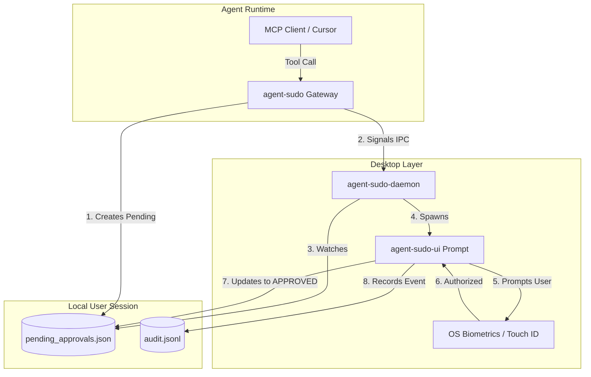
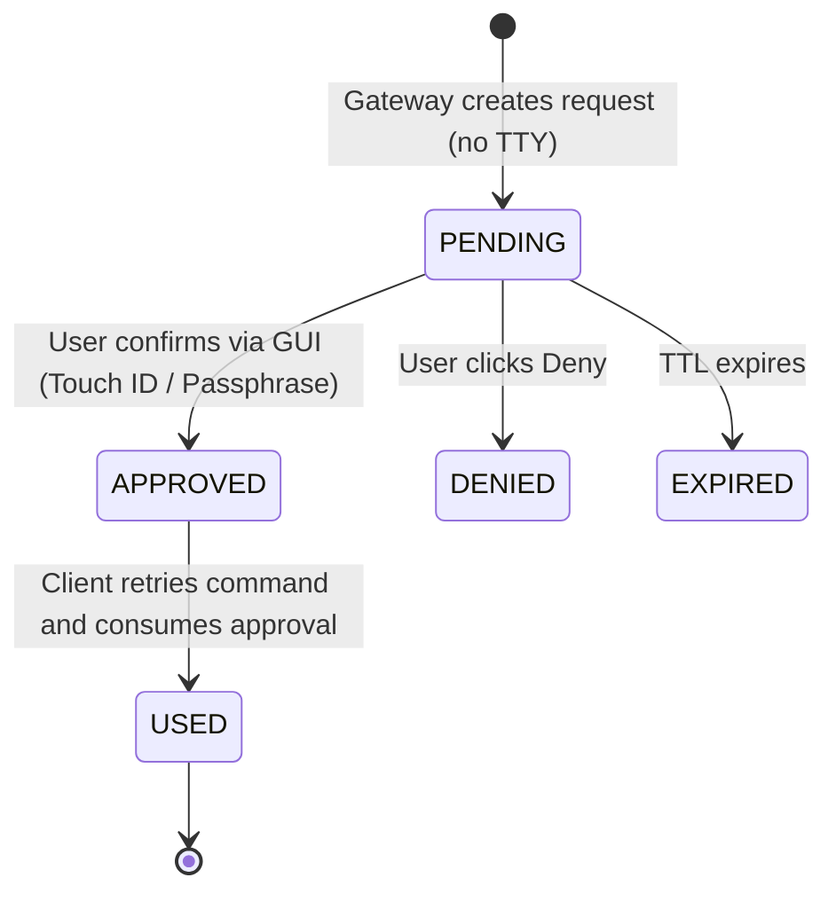

# Design Document: Secure Approval UX for agent-sudo

This document proposes a secure approval user experience (UX) for `agent-sudo` to eliminate terminal switching and manual UUID copying during Model Context Protocol (MCP) tool authorization workflows, while preserving core security guarantees.

---

## 1. Problem Statement

Under the current `v0.4.0-rc3` architecture, when an AI agent running in a headless MCP client (such as Claude Desktop or Cursor) requests a tool execution that requires manual confirmation:
1. `agent-sudo` halts execution, creates a pending approval record, and returns a command line command containing a UUID.
2. The user must manually leave their editor or chat interface, open a terminal window, run the `agent-sudo approve <uuid>` command, and type their passphrase (if it is a critical command).
3. The user must then switch back to the MCP client and instruct the agent to retry the tool call.

This loop acts as a significant usability friction point. To foster mainstream adoption, `agent-sudo` requires a mechanism to prompt the user directly on screen at the moment an approval is requested, without requiring terminal interaction or context switching.

---

## 2. Design Goals

### Security Requirements
* **Decoupled Gateway**: The core `PermissionGateway` must remain a headless Python library/CLI. It should have no hard dependencies on GUI toolkits.
* **Local-Only Boundary**: No cloud services, external webhooks, or telemetry. All communications must remain on the local machine (loopback or IPC only).
* **Cryptographic Auditing**: State changes (created, approved, denied, used) must continue to flow through the tamper-resistant hash-chained audit log.
* **External Content Isolation**: Untrusted content (`EXTERNAL_CONTENT` provenance) must remain blocked from triggering or auto-verifying its own approvals.
* **Passphrase Retention**: The existing PBKDF2 passphrase verification model must remain supported as a secure fallback.

### UX Requirements
* **Zero Terminal Switching**: Approvals should appear automatically on screen as desktop prompts or notifications when pending approvals are created.
* **Granular Context**: The approval dialog must clearly show the requesting **actor** (e.g. `mcp-client`), **action** (e.g. `run_shell_command`), **target** (e.g. `rm -rf /`), risk **classification** (`SENSITIVE` or `CRITICAL`), and the **reason** approval is needed.
* **Clear Actions**: Users must have immediate access to **Approve**, **Deny**, or **View Details**.
* **Informative Errors**: Lockout states, expired requests, and incorrect passphrases must be clearly communicated.

### Platform Requirements
* **Platform Priority**: macOS (initial target), with architectural paths for Windows and Linux.
* **Optional Install**: The UI component must remain completely optional. Headless/CI/CD deployments must continue working with standard CLI behavior.

---

## 3. Candidate Approaches

The following options have been evaluated for implementation complexity, security implications, usability, deployment overhead, and cross-platform viability:

### A. macOS osascript Popup Dialog
* **Implementation Complexity**: Low. Python subprocesses trigger system alerts using AppleScript via `osascript -e 'display dialog...'`.
* **Security Implications**: Moderate. Dialogs run in the user session but lack visual styling customization, making them susceptible to basic visual spoofing. If called directly from a background daemon, permissions on the Window Server may block GUI rendering on modern macOS.
* **Usability**: Low. AppleScript dialogs are blocking, look outdated, and cannot easily render structured information (such as code blocks or tables) or integrate with biometric auth.
* **Deployment Complexity**: Low. Requires no external dependencies.
* **Cross-Platform Viability**: None. macOS only.

### B. macOS Notification + Approval Helper
* **Implementation Complexity**: Moderate. Gateway triggers a standard macOS user notification (via `osascript` or a lightweight bundle). Clicking the notification launches a local CLI or GUI helper.
* **Security Implications**: High. Deep linking notifications to actions can be hijacked.
* **Usability**: Moderate. User gets a notification but still has to click it to open a window and approve, which is better than terminal switching but still requires two clicks.
* **Deployment Complexity**: Low.
* **Cross-Platform Viability**: Moderate. Every OS has a native notification mechanism, but handlers differ.

### C. Local Browser Approval Page
* **Implementation Complexity**: Moderate. The gateway launches a local temporary loopback server (`http://localhost:port`) and opens the user's default browser to a local page to authorize the action.
* **Security Implications**: Low. Opens up risks to local cross-site scripting (XSS), port binding conflicts, and browser hijacking by malicious local software scanning ports.
* **Usability**: Moderate. Opening a full browser window can feel disruptive and slow.
* **Deployment Complexity**: Moderate (requires spinning up and securing a local web server process).
* **Cross-Platform Viability**: High. Works identically on macOS, Windows, and Linux.

### D. Menu Bar Application
* **Implementation Complexity**: High. Requires a persistent native menu bar application (e.g. written in Swift/Obj-C for macOS, or using a cross-platform system tray library in Python like `pystray`).
* **Security Implications**: High. The app can watch the filesystem or listen on a local socket.
* **Usability**: High. Sits quietly in the menu bar and displays a clean, custom popup dialog immediately when a request is registered.
* **Deployment Complexity**: High. Requires packaging and code-signing desktop application bundles.
* **Cross-Platform Viability**: Moderate. Requires platform-specific UI bindings.

### E. Background Approval Daemon
* **Implementation Complexity**: Moderate. A background daemon runs as a local service (launchd/systemd) listening on a Unix domain socket or named pipe.
* **Security Implications**: High. Limits exposure compared to a port-binding HTTP server.
* **Usability**: Low on its own; requires a CLI or front-end GUI to display windows.
* **Deployment Complexity**: Moderate.
* **Cross-Platform Viability**: High. Unix sockets are standard on macOS/Linux; named pipes work on Windows.

### F. Touch ID / Keychain Integration
* **Implementation Complexity**: High. Calls native `LocalAuthentication` APIs via PyObjC or a helper binary.
* **Security Implications**: Extremely High. Leverages the secure enclave to verify local physical human presence before authorizing actions.
* **Usability**: Extremely High. User confirms actions via a simple biometric touch.
* **Deployment Complexity**: High (requires native binaries and signing).
* **Cross-Platform Viability**: Low. Windows Hello and Linux Secret Service require completely different native bindings.

### G. Hybrid Architecture (Recommended)
* **Design**: A decoupled local architecture combining:
  1. A Unix domain socket listener or filesystem watcher.
  2. A native, lightweight **Desktop Helper** that monitors the pending approval state.
  3. Biometric integration (Touch ID/Windows Hello) falling back to local passphrase inputs.
* **Implementation Complexity**: High.
* **Security Implications**: High. Completely local, cryptographically auditable, and decoupled.
* **Usability**: High.
* **Deployment Complexity**: Moderate (optional wrapper, CLI remains standalone).
* **Cross-Platform Viability**: High (daemon protocol is standard; front-ends are swapped per OS).

---

## 4. Recommended Architecture

The hybrid approach provides the cleanest decoupling between the security-sensitive `PermissionGateway` and the OS-specific desktop UI.



### Component Details
1. **The Gateway (Python CLI/Library)**:
   * Normalizes tool calls.
   * If approval is required, creates a pending record in `pending_approvals.json` with status `PENDING`.
   * Sends an IPC notification over a local Unix domain socket (or named pipe on Windows) to the local daemon if active. If the daemon is inactive, it falls back to standard CLI pending behavior without error.
2. **The local Daemon (`agent-sudo-daemon`)**:
   * A persistent, user-space background service.
   * Listens on the local Unix domain socket (`~/.agent-sudo/ipc.sock`).
   * When signaled, it reads the target metadata from `pending_approvals.json`.
   * Spawns the visual popup helper (`agent-sudo-ui`).
3. **The UX Helper (`agent-sudo-ui`)**:
   * A lightweight native GUI application. On macOS, this is a native Swift helper or a PyObjC application bundle.
   * Displays the popup card containing action metadata.
   * Integrates with macOS `LocalAuthentication` to prompt for Touch ID for critical actions. If biometric authentication fails or is unavailable, it displays a passphrase input text field.
   * Updates `pending_approvals.json` directly to `APPROVED` or `DENIED` and writes to the audit log.

### State Transitions


### Key Interactions

#### Pending Approval Storage
All state coordination is file-bound via `pending_approvals.json`. The Gateway write operations are atomic (write-to-tmp and rename) to prevent race conditions.

#### Audit Log Interaction
The UI helper operates with user-level privileges. When an action is approved, the UI helper appends an entry to the audit log (`audit.jsonl`), re-calculating the hash chain from the last verified block hash to ensure complete consistency.

#### Authentication Interaction
For `SENSITIVE` classifications, the helper prompts the user with standard **Approve** and **Deny** buttons. For `CRITICAL` classifications, clicking **Approve** triggers the OS Local Authentication context (biometric check). If successful, the helper marks the request `APPROVED`.

#### Failure Handling & Offline Behavior
* **IPC Socket Down**: If the GUI daemon is not running, the Gateway writes the pending approval to disk and prints the manual CLI command to stderr. The tool call suspends normally.
* **Offline Operation**: Since the entire system is local (local file state, local UNIX IPC, local OS biometrics), it requires no internet connection to function.
* **Corrupt JSON State**: If the JSON store becomes corrupted, the daemon/UI fails safe by rejecting the state, reporting the error on stderr, and requiring a fresh init.

---

## 5. Security Analysis (Threat Model)

### Spoofed Approval Windows
* **Threat**: A malicious script in user-space displays a fake `agent-sudo` approval prompt asking the user to authorize a command or type their passphrase.
* **Mitigation**:
  * For critical actions, native OS biometric prompts (e.g. Touch ID) are managed by the operating system kernel and cannot be visually spoofed or intercepted by user-space scripts.
  * The GUI application is code-signed with standard developer certificates.
  * The dialog window is launched as an agent of the operating system window manager, indicating its process source.

### Approval Replay Attacks
* **Threat**: A malicious agent intercepts an approved UUID and attempts to run a different malicious command using the same approval identifier.
* **Mitigation**:
  * Approved records are bound strictly to the cryptographic fingerprint of the original `ActionRequest` (hash of actor, action, target, and session data).
  * The gateway validates that the retried request matches the approved fingerprint exactly.
  * Once matched, the approval status is atomically transitioned to `USED` and cannot be re-used.

### Approval Race Conditions
* **Threat**: An agent launches two simultaneous tool calls. The user clicks approve on one, but the state transitions allow the wrong command to slip through.
* **Mitigation**:
  * File writes and state transitions are secured via local file locks (`fcntl` on Unix, locking APIs on Windows).
  * State updates to `APPROVED` specify the unique `approval_request_id` and are matched explicitly, not generically.

### Unauthorized Local Approval Attempts
* **Threat**: A malicious background script accesses the `pending_approvals.json` database and edits status fields directly to bypass user review.
* **Mitigation**:
  * The directories `~/.agent-sudo` and `~/.agent-runtime` are created with strict permissions (`0700` for directories, `0600` for files).
  * Other user-space processes running under different accounts are blocked by filesystem-level access controls.
  * *Future Enhancement*: The daemon signs approved transactions using a private key stored securely in the system Keychain. The Gateway verifies the signature using the daemon's public key before allowing execution.

### Malicious MCP Clients
* **Threat**: A compromised MCP client modifies the wrapper command to bypass `agent-sudo-mcp` entirely.
* **Mitigation**:
  * This is outside `agent-sudo`'s boundary. The runtime environment must block direct access to raw execution shells, ensuring the agent's environment only exposes tools via the `agent-sudo-mcp` proxy.

---

## 6. UX Flow

### First-Time Onboarding
1. The user installs `agent-sudo` and runs `agent-sudo doctor`.
2. The doctor reports:
   ```text
   WARN: approval config exists - not initialized: run agent-sudo init-approval
   
   APPROVALS: NOT INITIALIZED
   
   Recommended:
   agent-sudo init-approval
   ```
3. The user runs `agent-sudo init-approval` and sets their local passphrase.
4. The user starts their desktop daemon (optional system startup service).

### Sensitive Approval Flow
1. The agent requests `write_file` to `~/project/README.md`.
2. The user sees a native OS alert popup card:
   ```text
   -------------------------------------------------
   [Sudo Check] Approval Requested
   -------------------------------------------------
   Actor:   mcp-client
   Action:  write_file
   Target:  ~/project/README.md
   
   Classification: SENSITIVE
   Reason: Target is a project file.
   -------------------------------------------------
   [ Approve ]          [ Deny ]      [ Details ]
   -------------------------------------------------
   ```
3. The user clicks **Approve**. The card dismisses immediately, and the agent continues.

### Critical Approval Flow
1. The agent requests `run_shell_command` with `npm install`.
2. The user sees the native OS alert card:
   ```text
   -------------------------------------------------
   [Sudo Check] CRITICAL Action Approval Needed
   -------------------------------------------------
   Actor:   mcp-client
   Action:  run_shell_command
   Target:  npm install
   
   Classification: CRITICAL
   Reason: Shell execution is critical by default.
   -------------------------------------------------
   [ Touch ID / Confirm Passphrase ]    [ Deny ]
   -------------------------------------------------
   ```
3. Clicking confirmation triggers the OS biometric prompt. Upon fingerprint match (or entering the fallback passphrase), the action is authorized.

---

## 7. MVP Recommendation

To implement this with minimal complexity while preserving cross-platform paths:
1. **Daemon**: Written in Python as a background service. It watches `~/.agent-sudo/pending_approvals.json` using the cross-platform file watching library `watchdog`.
2. **Notification Layer**:
   * On **macOS**: Spawns a lightweight native AppleScript card or utilizes `tkinter` (which is bundled with Python) configured with modern CSS-like layouts to render clean cards.
   * On **Windows**: Spawns a Tkinter or native toast window.
   * On **Linux**: Employs `notify-send` for standard desktop alerts or a Tkinter frame.
3. **Biometrics**: Omit Touch ID for the initial MVP. Rely on the user confirming `SENSITIVE` actions with a button click, and typing their passphrase into a clean GUI text entry card for `CRITICAL` actions.

---

## 8. Future Enhancements

* **OS Biometrics Integration**: Provide native compiled helpers (e.g. written in Swift/Obj-C for macOS, C# for Windows Hello, PAM modules for Linux) to replace the password entry field with secure biometric authorization.
* **Process Binding**: Validate the PID of the process signaling the IPC socket to confirm it originates from the trusted local `agent-sudo` installation path.
* **Auto-Focus Management**: Ensure popup dialogs grab focus on launch, allowing power users to hit `Esc` to deny or `Enter` to prompt for credentials instantly.

---

## 9. What Should NOT Be Implemented

* **No Cloud-Sync Service**: Do not implement web dashboards, sync servers, or cloud databases. Approvals must stay restricted to the host machine.
* **No Remote Webhooks**: Do not allow approvals via Slack, Discord, or mobile push services (unless fully routed through a secure local USB/Bluetooth relay), as this exposes the local gateway to remote API compromise.
* **No Passphrase Auto-Caching**: To maintain strong security, passphrases must not be cached in cleartext memory or automatically stored in active session state. Biometric authorization serves as the convenient alternative.
* **No Auto-Approval of Blocked Lists**: The UI helper must never present an "Approve anyway" button for actions classified as `BLOCKED` by the policy engine.
