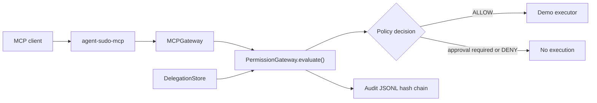

# End-to-End MCP Demo

This demo shows the validated `v0.4.0-rc2` workflow: a critical shell action is blocked without approval, allowed once by scoped delegation, then denied after the token is exhausted.

The local path in the transcript is redacted as `~/agent-sudo` so the demo is safe to publish.

## Architecture



## Request Flow

1. The MCP client sends `tools/call` for `run_shell_command`.
2. `agent-sudo-mcp` converts the MCP call into an `ActionRequest`.
3. `MCPGateway` sends the request to `PermissionGateway.evaluate()`.
4. The classifier marks `run_shell_command` as `CRITICAL`.
5. The policy requires strong approval unless a matching scoped delegation exists.
6. Execution happens only when the final decision is `ALLOW`.

## Approval Flow

The first request has no matching delegation and no interactive passphrase approval available through MCP.

Result:

- classification: `CRITICAL`
- decision: `REQUIRE_STRONG_APPROVAL`
- executed: `false`

This is the expected safe behavior for non-interactive MCP clients.

## Delegation Flow

A scoped delegation is created:

```text
actor=codex
action=run_shell_command
target=pwd
max_uses=1
critical=true
```

The next matching request is allowed by delegation and executed once.

The following identical request is denied because the delegation token is exhausted.

## Audit Flow

Every decision is written to JSONL audit with hash-chain fields:

- `previous_hash`
- `entry_hash`

The three expected audit decisions are:

```text
REQUIRE_STRONG_APPROVAL
ALLOW
DENY
```

## Actual Validation Transcript

### 1. Initial MCP Request

```json
{
  "actor": "codex",
  "tool": "shell",
  "action": "run_shell_command",
  "target": "pwd"
}
```

Result:

```text
classification: CRITICAL
decision: REQUIRE_STRONG_APPROVAL
executed: false
```

### 2. Scoped Delegation Created

```text
actor: codex
allowed action: run_shell_command
allowed target: pwd
max uses: 1
critical: true
```

### 3. Delegated MCP Request

```json
{
  "actor": "codex",
  "tool": "shell",
  "action": "run_shell_command",
  "target": "pwd"
}
```

Result:

```text
classification: CRITICAL
decision: ALLOW
approval method: DELEGATION
executed: true
output: ~/agent-sudo
```

### 4. Exhausted Delegation

The MCP client repeats the same request:

```text
classification: CRITICAL
decision: DENY
executed: false
reason: delegation token is exhausted
```

## Security Rationale

This validates least privilege for MCP clients:

- Critical shell actions do not run by default.
- A delegation grants one narrow permission: one actor, one action, one target, one use.
- The same request is denied after the allowed use is consumed.
- Every step is auditable.

The gateway still cannot protect tools the agent can call directly. Enforcement requires routing dangerous tools through `agent-sudo-mcp` and removing direct shell/file access where possible.
