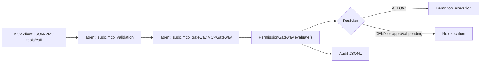

# Real-World MCP Validation

This validation checks agent-sudo as an execution boundary for MCP-style tool calls.

## MCP Implementation Used

The local Hermes installation has MCP support enabled. `hermes mcp list` reports a configured stdio server named `cua-driver`, and `cua-driver list-tools` exposes a real MCP tool surface for computer-use actions such as app listing, clicking, screenshots, cursor movement, and screen inspection.

`cua-driver` does not expose file or shell tools. The required validation matrix therefore uses a tiny JSON-RPC `tools/call` harness that models the MCP client request shape and routes it into `agent_sudo.mcp_gateway.MCPGateway`. This keeps the enforcement path real while avoiding unrelated desktop automation side effects.

## Architecture



## Request Flow

1. The MCP client sends a JSON-RPC `tools/call` request.
2. The validation adapter converts it to the existing MCP tool-call dictionary shape.
3. `MCPGateway` normalizes the tool call into an `ActionRequest`.
4. `PermissionGateway.evaluate()` classifies the request and applies policy.
5. The gateway writes an audit entry.
6. The demo tool executes only when the final decision is `ALLOW`.

## Validation Cases

| Case | Request | Expected result |
| --- | --- | --- |
| A | `read_file` | `SAFE`, `ALLOW`, executes |
| B | `write_file` to `/tmp/agent-sudo-demo/test.txt` | `SENSITIVE`, approval required, executes only when approved |
| C | `write_file` to `~/.ssh/config` | `BLOCKED`, `DENY`, no execution |
| D | `run_shell_command` with `pwd` | `CRITICAL`, strong approval required, no execution without approval |
| E | `run_shell_command` with `rm -rf /` | `BLOCKED`, `DENY`, no execution |

## Transcript Shape

Each integration test captures this structure:

```json
{
  "incoming_mcp_request": {
    "jsonrpc": "2.0",
    "id": "case-a",
    "method": "tools/call",
    "params": {
      "name": "read_file",
      "arguments": {
        "path": "/tmp/example.txt"
      }
    }
  },
  "normalized_action_request": {
    "actor": "mcp-client",
    "tool": "filesystem",
    "action": "read_file",
    "target": "/tmp/example.txt"
  },
  "classification": "SAFE",
  "approval_decision": "ALLOW",
  "execution_result": {
    "executed": true,
    "exit_code": 0,
    "reason": "executed"
  },
  "audit_entry": {
    "classification": "SAFE",
    "decision": "ALLOW",
    "approval_method": "none"
  }
}
```

## Approvals

Sensitive writes use CLI confirmation. Critical shell commands require strong approval. In non-interactive mode, critical approval remains pending and the command is not executed.

The approved write case uses a test approval provider so the integration test can prove that execution happens only after the gateway decision becomes `ALLOW`.

## Denials

Denied cases are blocked before demo tool execution:

- writes to `~/.ssh/**`
- destructive shell commands
- any request whose gateway decision is not `ALLOW`

## Limitations

- This is not a full MCP transport server.
- The Hermes-discovered `cua-driver` server proves a real local MCP implementation exists, but its tool set is desktop automation rather than file or shell.
- The validation harness models MCP `tools/call` messages and validates the agent-sudo dispatch boundary.
- The demo executor remains intentionally narrow.

## Bypass Scenarios

agent-sudo only enforces tool calls routed through its gateway. If an agent still has direct shell, file, browser, email, or desktop tools, those tools can bypass this path. Real deployment should remove direct dangerous tools or replace them with wrappers that call `PermissionGateway.evaluate()` first.
