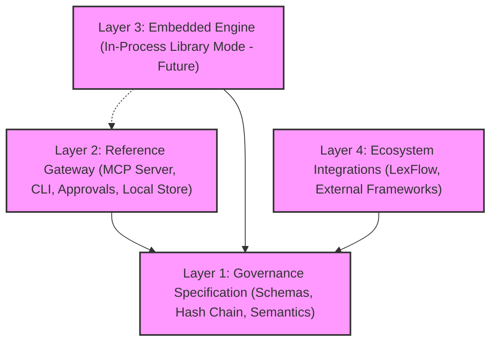

# Layered Architecture Specification (Direction D)

This document specifies the layered architectural strategy (Direction D) for `Agent_Sudo`. To support long-term ecosystem expansion without destabilizing the core implementation, the codebase is structured into four distinct concern layers.

---

## 1. The Four Architectural Layers



### Layer 1: Governance Specification (Stable Foundation)
This is the immutable specification layer containing schema definitions and mathematical/cryptographic contracts. It defines:
- Stable JSON schemas for policy evaluation input (`ActionRequest`), decision output (`PolicyDecision`), and event records (`AuditRecord`).
- Core classification states (`SAFE`, `SENSITIVE`, `CRITICAL`, `BLOCKED`) and authorization semantics.
- Cryptographic hash-chain rules for log entries to prevent and detect log tampering.

### Layer 2: Reference Gateway & Runtime (Default Implementation)
This is the default out-of-the-box runtime environment implementing Layer 1. It comprises:
- The stdio-based Model Context Protocol (MCP) server daemon (`agent-sudo-mcp`).
- The command-line interface (`agent-sudo`) for managing state and operator confirmations.
- Local configuration stores (`~/.agent-sudo/` folder containing local passphrase hashes, pending approvals, and active delegation tokens).

### Layer 3: Embedded Engine (In-Process Library)
*Status: Design Exploration / Deferred for stabilization*  
This layer allows host processes to import `Agent_Sudo` directly as a library, executing evaluation logic inside their own Python threads. It avoids process boundary crossings and network hops, serving single-process desktop applications.

### Layer 4: Ecosystem Integrations (Interoperability)
This layer enables heterogeneous agent platforms (such as LexFlow, desktop wrappers, or server-side frameworks) to cooperate with the gateway by consuming shared delegation tokens, writing to compatible log files, and enforcing equivalent security semantics.

---

## 2. Logic Extraction Boundaries

To successfully support in-process execution and ecosystem alignment, we define which components of `Agent_Sudo` are portable versus which must remain gateway-specific.

```
+-------------------------------------------------------------------------+
|                        PORTABLE CORE LAYER                              |
|  - Policy evaluation matching                                           |
|  - Scoped path delegation rules                                         |
|  - Canonical JSON log formatting                                        |
|  - SHA-256 hash chaining                                                |
+-------------------------------------------------------------------------+
                                     ^
                                     | (Inherits / Implements)
                                     v
+------------------------------------+------------------------------------+
|          GATEWAY-SPECIFIC          |          EMBEDDED SPECIFIC         |
|  - Stdio JSON-RPC streams          |  - Thread-safe Python library API  |
|  - Interactive TTY prompts         |  - In-memory event dispatching     |
|  - PBKDF2 local passphrase hashing |  - Read-only delegation mappings   |
|  - CLI approval workflows          |  - Client-managed storage adapters |
+------------------------------------+------------------------------------+
```

### Portable Logic
This logic can be extracted or implemented in any environment (including non-Python platforms) and must yield identical behaviors:
- **Policy Evaluation**: Classifying action types against standard risk bands based on string parameters.
- **Delegation Matching**: Comparing an incoming request's `actor`, `action`, and `target` against active scopes, decrementing allowed use counts, and verifying time bounds.
- **Audit Verification**: Calculating the SHA-256 canonical hash chain to verify audit log integrity.

### Gateway-Specific Logic
This logic belongs strictly to the reference command-line and MCP runtime, and is not exported:
- **Stdio Transport**: Reading/writing JSON-RPC messages over standard streams.
- **Operator Prompts**: Launching TTY prompts to ask the user for verification.
- **Local Credentials**: Hashing passphrases using PBKDF2 and storing configuration locally under `~/.agent-sudo/config.json`.
- **CLI Commands**: Subcommands like `pending`, `approve`, `deny`, and `doctor`.

---

## 3. Immediate External Utility Requirements

Ecosystem integrations (such as LexFlow) require lightweight helper utilities first, before full engine APIs are stabilized. The initial portable utilities include:
- **`agent_sudo.spec_helpers.validation`**: A module to validate that dictionary payloads match the standard `ActionRequest` and `PolicyDecision` formats.
- **`agent_sudo.spec_helpers.audit`**: A module exposing the canonical JSON serializer and audit-line writer, ensuring external systems write cryptographically verifiable log entries compatible with the reference validator.
- **`agent_sudo.spec_helpers.delegation`**: A parser helper to read and match scopes in `~/.agent-sudo/delegations.json`.
