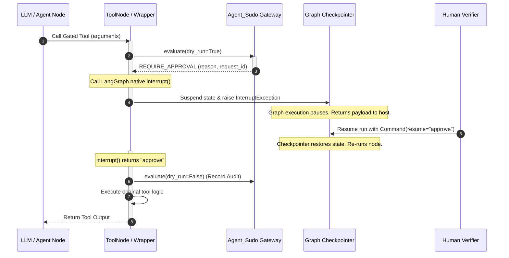

# LangGraph Integration Feasibility Study

This feasibility study evaluates integrating `Agent_Sudo` with **LangGraph** (`langchain-ai/langgraph`), the popular graph-based agent orchestration framework.

---

## 1. Architecture Flow Diagram

Below is the execution flow showing how LangGraph's state machine interacts with `Agent_Sudo` for policy checking, human-in-the-loop interrupts, and audit logs.

---

## 2. Interception Points

LangGraph provides three clean levels of interception for tool security:

### 2.1 Tool Wrapper Interception (Highest Value)
*   **Location:** Individual `tool` functions passed into the graph.
*   **Mechanism:** Wrap each registered tool in a decorator that intercept calls.
*   **Pros:** Granular, works with any graph structure or custom node, does not require customizing the graph compiler.
*   **Cons:** Must wrap tools individually.

### 2.2 Prebuilt ToolNode Subclassing
*   **Location:** `langgraph.prebuilt.ToolNode` node.
*   **Mechanism:** Subclass `ToolNode` to intercept the execution step before invoking the underlying registry tools.
*   **Pros:** Centralized chokepoint for all tools.
*   **Cons:** Only works if the graph uses `ToolNode` for execution.

### 2.3 Graph Node Breakpoints
*   **Location:** Graph Compilation layer (`builder.compile(interrupt_before=["tools"])`).
*   **Mechanism:** Pauses before executing the tools node.
*   **Pros:** Native configuration.
*   **Cons:** Coarse-grained (pauses before checking if the tool call is actually dangerous).

---

## 3. Approval Flow

LangGraph implements human-in-the-loop via two mechanisms:
1.  **Checkpointer:** Graph runs require a state checkpointer (`MemorySaver`, `SqliteSaver`, etc.) to support pauses.
2.  **`interrupt()` Function:** Calling `langgraph.types.interrupt(payload)` inside a tool raises an exception that pauses the graph. When resumed via `Command(resume="approve")`, the runtime restores state and returns `"approve"` from the `interrupt()` call on re-execution.

---

## 4. Audit Flow

1.  **Preflight check (`dry_run=True`):** Before executing the tool or calling the interrupt, `PermissionGateway.evaluate(request, dry_run=True)` runs to check for policy violations.
2.  **State Save:** If approval is needed, the graph suspends.
3.  **Audit Commit (`dry_run=False`):** Once resumed with an `"approve"` response, the wrapper calls `gateway.evaluate(request, dry_run=False)` to commit the approved transaction to the tamper-evident audit ledger.

---

## 5. Implementation Complexity: Very Low

Integration with LangGraph is extremely clean because:
*   **Zero Core Modifications:** It does not require modifying LangGraph itself.
*   **Pure Decorator Pattern:** A simple python decorator wrapping LangChain tools is sufficient to enable policies, approvals, and logging.
*   **Native Checkpointing:** Reuses LangGraph's robust checkpointer and `Command` interfaces.

---

## 6. Recommended Future Path

### Outreach Readiness: Medium
LangChain maintainers are highly focused on enterprise security and human-in-the-loop governance. However, the repository has high traffic. We should establish authority by publishing a working example first.

### Recommendation: Build Example
Do not contact LangGraph maintainers or open issues. We should:
1.  Build a standalone example in `examples/langgraph_integration.py` demonstrating `Agent_Sudo` gating tool calls using LangGraph's checkpointer.
2.  Document the pattern in `docs/examples/langgraph.md` to show developers how to implement policy controls in LangGraph without forking.
