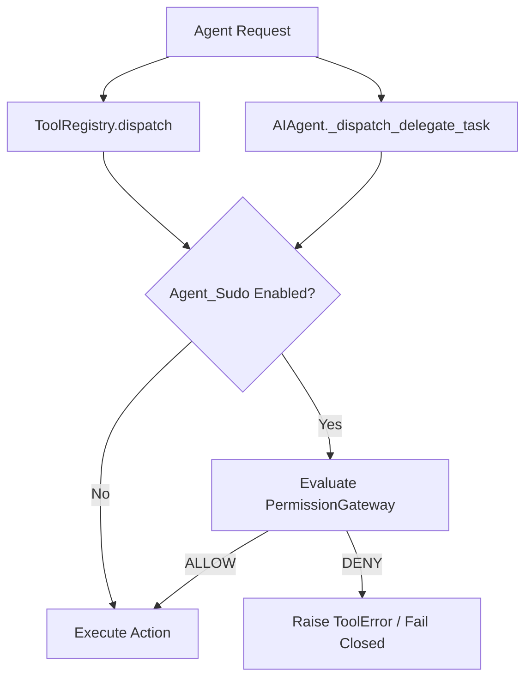

# Hermes Integration Research Note

This document details the architectural findings and integration path for running the `Agent_Sudo` authorization/provenance engine within the `Hermes` personal AI runtime.

> [!NOTE]
> This document represents a **research study / local Proof of Concept (PoC)**. Hermes does not officially support Agent_Sudo at this stage.

---

## 1. Problem Statement

Autonomous agent runtimes (such as Hermes) execute powerful local commands, edit codebases, and interact with external networks. Under untrusted inputs (e.g. prompt injections, malicious files), agents can execute harmful actions. 

Integrating `Agent_Sudo` provides Hermes with:
*   Granular, context-aware policy enforcement.
*   Interactive approvals for high-risk actions.
*   Cryptographically secured audit logging.

---

## 2. Dispatch Chokepoints & Bypasses

A key objective of the Hermes PoC was to identify a single, reliable chokepoint to prevent bypasses.

### Core Dispatch Gate
The optimal place to gate standard tools is:
*   `tools/registry.py::ToolRegistry.dispatch()`

This centralized execution point catches:
1.  **Native Tools**: Native filesystem, terminal, and browser capabilities.
2.  **MCP Tools**: Model Context Protocol-provided external servers.
3.  **Plugin Tools**: Custom extensions loaded by Hermes.
4.  **Direct Dispatch Calls**: Programmatic calls made via `PluginContext.dispatch_tool()`.

*Why previous gates failed*: Local PoC testing showed that gating only higher-level entry points (like `handle_function_call()` and `invoke_tool()`) was insufficient because plugin slash commands could invoke `PluginContext.dispatch_tool("terminal", {...})` which bypassed those layers, calling `ToolRegistry.dispatch()` directly.

### The Delegation Bypass
A critical exception was discovered:
*   `run_agent.py::AIAgent._dispatch_delegate_task()`

Task delegation runs outside of the standard tool registry. To enforce security policies on task delegation, this method must be gated separately.

---

## 3. Phase 1 Architecture (Local PoC)

The Phase 1 PoC established a lightweight, optional, and local-first integration:



### Scope & Characteristics
*   **Disabled by Default**: Only activates when explicitly enabled in Hermes configuration.
*   **Fail-Closed Semantics**: If the gateway is enabled but fails to initialize (e.g., corrupt policy configuration), the runtime fails closed and blocks execution.
*   **Local Processing**: Directly utilizes the in-process Python `PermissionGateway` (Level 2 compatibility). No MCP wrappers or external network daemons are required.
*   **Gated Actions**: Gates `terminal`, `write_file`, `patch`, `execute_code`, `computer_use`, `cronjob`, `send_message`, `process`, `skill_manage`, browser mutation tools, all MCP tools, and `delegate_task`.

### Delegation Store Path

Hermes integrations may configure their own Agent_Sudo delegation store. A token only authorizes Hermes if it is created in the same store Hermes reads.

For a Hermes runtime with a dedicated delegation store, create delegations with `--delegations-file` pointing at that active store:

```bash
agent-sudo delegate create \
  --actor hermes \
  --allow-action edit_file \
  --allow-path /path/to/hermes-agent/agent_sudo_bridge.py \
  --ttl-seconds 900 \
  --max-uses 1 \
  --reason "Hermes scoped edit approval" \
  --delegations-file /path/to/hermes/agent_sudo_audit/delegations.json
```

If `--delegations-file` is omitted, the CLI writes to `~/.agent-sudo/delegations.json`, which Hermes may not read.

---

## 4. Phase 2: Chat-Native Approval Bridge

Hermes operates as a persistent desktop/server agent controlled via messaging channels (Telegram, Discord, Slack) and has its own production-grade chat approval interface. **Agent_Sudo should not implement these messaging adapters.**

### Ownership Boundaries

| Component | `Hermes` (Runtime) | `Agent_Sudo` (Gateway) |
| :--- | :---: | :---: |
| **Runtime Execution Loop** | Control | |
| **UI Adapters (Telegram/Slack/Discord)**| Control | |
| **Approval Lifecycle (Pause/Event/Resume)**| Control | |
| **Audit Log File Persistence** | Control | |
| **Policy Rules Evaluation** | | Control |
| **Delegation Semantics & Tokens** | | Control |
| **Cryptographic Audit Spec** | | Control |
| **Verification Tooling** | | Control |

### Decision Mapping
When Hermes intercepts an action, it queries Agent_Sudo and maps the decision output into its native approval primitive (`tools/approval.py` using `resolve_gateway_approval()` and `threading.Event` blocks):

1.  **`ALLOW`**: Execute the tool normally.
2.  **`DENY`**: Suppress execution and return a standard Hermes tool execution error.
3.  **`REQUIRE_APPROVAL`**: Pause execution thread, emit a Telegram inline keyboard or Slack Block Kit approval card, and wait for human confirmation.
4.  **`REQUIRE_STRONG_APPROVAL`**: Call the same approval primitive, but suppress options like "always allow" or "allow session" to enforce strict verification.

---

## 5. Limitations & Future Work

The current PoC has the following unresolved areas:
*   **Approval Bridge Implementation**: Writing the actual callback handlers connecting Agent_Sudo decisions to Telegram/Discord Webhooks.
*   **Headless Policy**: Standardizing how cron/scheduled tasks resolve approval gates (which must auto-deny or flag alerts).
*   **YOLO Mode (`/yolo`)**: Allowing the user to temporarily bypass the gateway for a specific session without changing the main policy file.
*   **Audit Crosswalk**: Correlating Hermes' internal chat session database logs with the cryptographically signed Agent_Sudo audit log events.
*   **Upstream Integration**: Aligning with the Hermes core development team to accept and merge the integration hooks.
