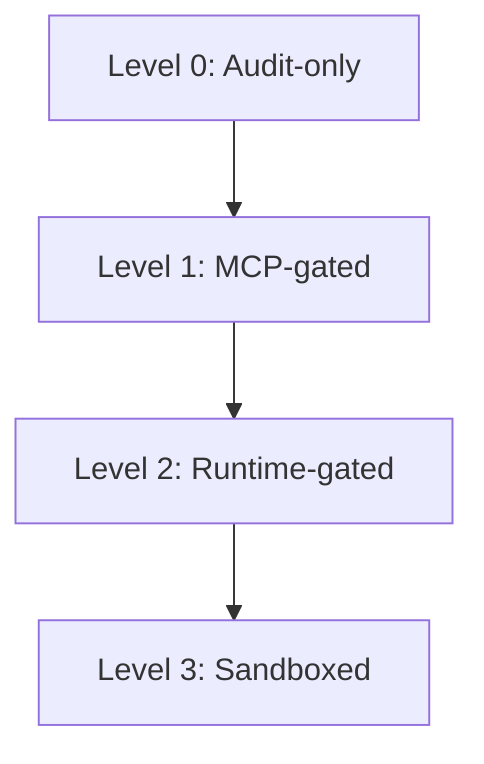

# Host Runtime Compatibility Levels

This document defines a structured compatibility matrix for integrating external AI agent runtimes (such as `Hermes`, `OpenClaw`, `Eino`, or `agent-runtimes`) with `Agent_Sudo` policy and audit semantics.

---

## Compatibility Levels Overview

| Level | Name | Enforcement Mechanism | Bypass Resistance | Integration Type |
| :--- | :--- | :--- | :--- | :--- |
| **Level 0** | Audit-only | Cryptographic Hash Chain | None (Audit logging only) | In-process logger / spec_helpers |
| **Level 1** | MCP-gated | Gateway Server Interception | Low (Runtimes can bypass via native tools) | Standard MCP stdio / network gateway |
| **Level 2** | Runtime-gated | In-Process Dispatch Hooks | High (Validates native and external tools) | Pluggable middleware / dispatcher hooks |
| **Level 3** | Sandboxed | OS/Container Isolation | Complete (Restricts kernel/syscall surface) | Virtualization / gVisor / Docker |

---

## Detailed Compatibility Specifications

### Level 0: Audit-only
**Goal**: The runtime generates structured, cryptographic audit logs that can be validated off-line using the `agent-sudo verify-audit` command-line utility.

* **What the runtime must do**:
  - Incorporate the lightweight `agent_sudo.spec_helpers` module (or implement identical canonical hash-chain hashing logic).
  - Emit log lines in the standard JSONL format conforming to the `AuditRecord` schema.
  - Compute each entry's `entry_hash` as the SHA-256 hash of the canonical JSON representation of the current entry concatenated with the `previous_hash` of the preceding record:
    `entry_hash = sha256(previous_hash + canonical_json(current_entry_without_hash))`
  - Save audit logs to `~/.agent-sudo/mcp-audit.jsonl` or another user-configured log path.

---

### Level 1: MCP-gated
**Goal**: The runtime routes standard file and shell command tools through the `agent-sudo-mcp` gateway server.

* **What the runtime must do**:
  - Disable its own built-in native filesystem and terminal execution tools (e.g., `execute_code`, `read_file`, `write_file`, `terminal`).
  - Configure `agent-sudo-mcp` as a stdio/network Model Context Protocol server.
  - Route all file and command calls initiated by the agent through the registered MCP gateway tools.
  - Handle non-interactive `REQUIRE_APPROVAL` decisions by outputting the pending approval command details (e.g., `agent-sudo approve <id>`) to the console and waiting for the user to resume.

---

### Level 2: Runtime-gated
**Goal**: The runtime intercepts all tool dispatches (both native in-process and external MCP) in its central dispatch loop before they are executed.

* **What the runtime must do**:
  - Implement a pluggable tool middleware layer with pre-execution and post-execution hooks (e.g., `before_tool_execute` / `after_tool_execute`).
  - Call the `agent_sudo.gateway.PermissionGateway.evaluate(request)` engine in-process before executing *any* tool, including Python code execution tools (`execute_code`), GUI automation, or browser tools.
  - Deny execution immediately if the gateway evaluates the request to `Decision.DENY` or `Classification.BLOCKED`.
  - Pause tool execution and launch/display the interactive approval workflow if the decision is `REQUIRE_APPROVAL` or `REQUIRE_STRONG_APPROVAL`.
  - Record the tool request, classification, decision, and exit codes to the local audit hash chain post-execution.

---

### Level 3: Sandboxed
**Goal**: The runtime isolates tool execution inside a secure, containerized, or virtualization boundary, guaranteeing that shell commands cannot touch or modify the host filesystem or the `Agent_Sudo` configuration state.

* **What the runtime must do**:
  - Run the agent interpreter and shell command executor inside isolated containers (e.g., Docker, podman) or sandboxed microVMs (e.g., gVisor, Firecracker).
  - Mount configuration files (like `~/.agent-sudo/policy.yaml`) and audit logs as read-only volumes, or do not expose them to the container file system at all.
  - Enforce user namespace boundaries, running the tool subprocesses as a separate, non-privileged Unix user account (`_agent_sandbox`) that has no write permissions to files owned by the gateway user.
